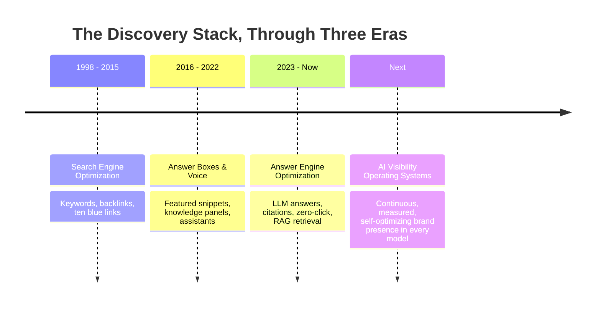
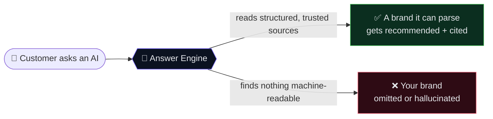
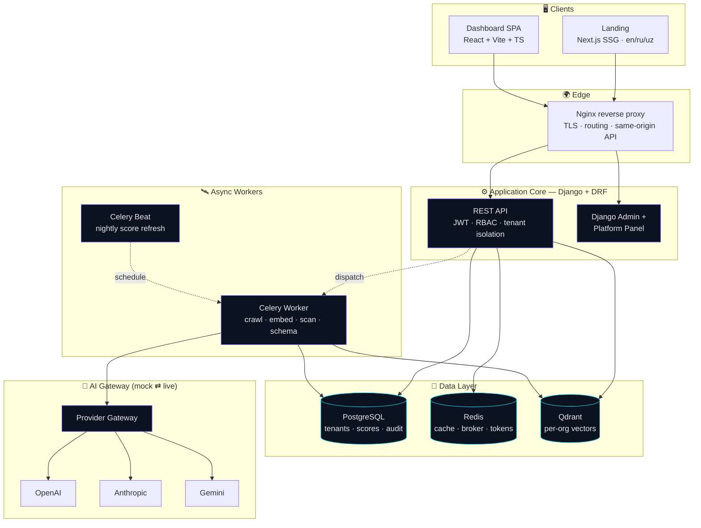
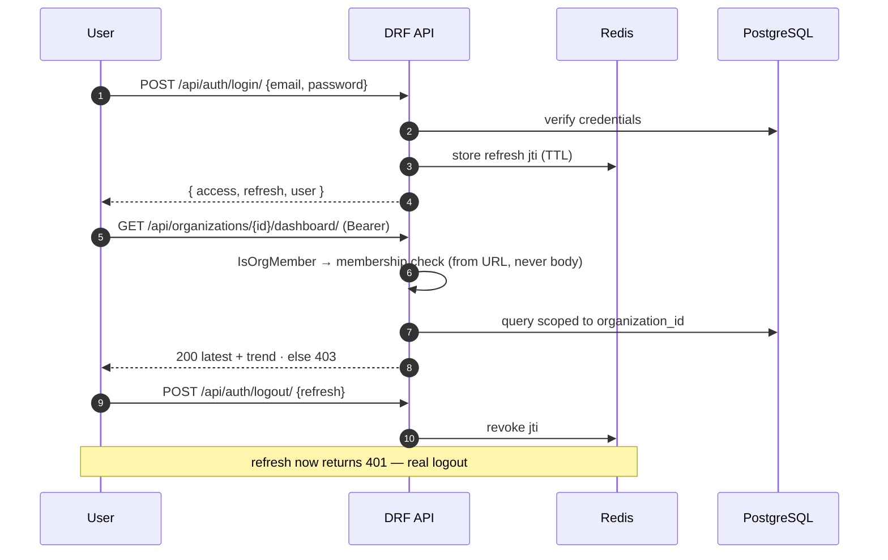
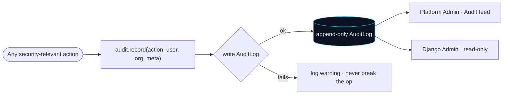
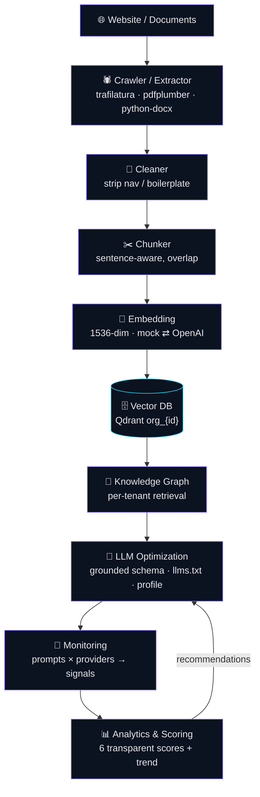
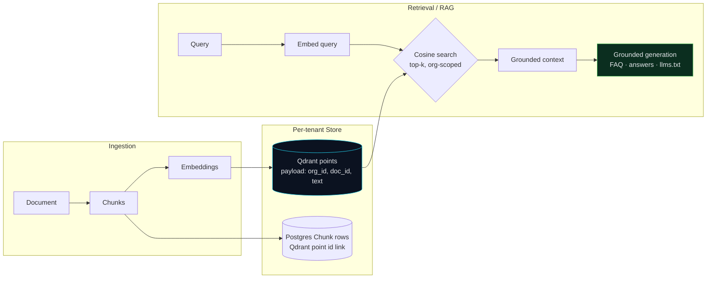
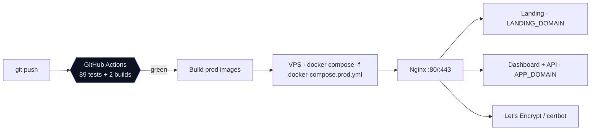
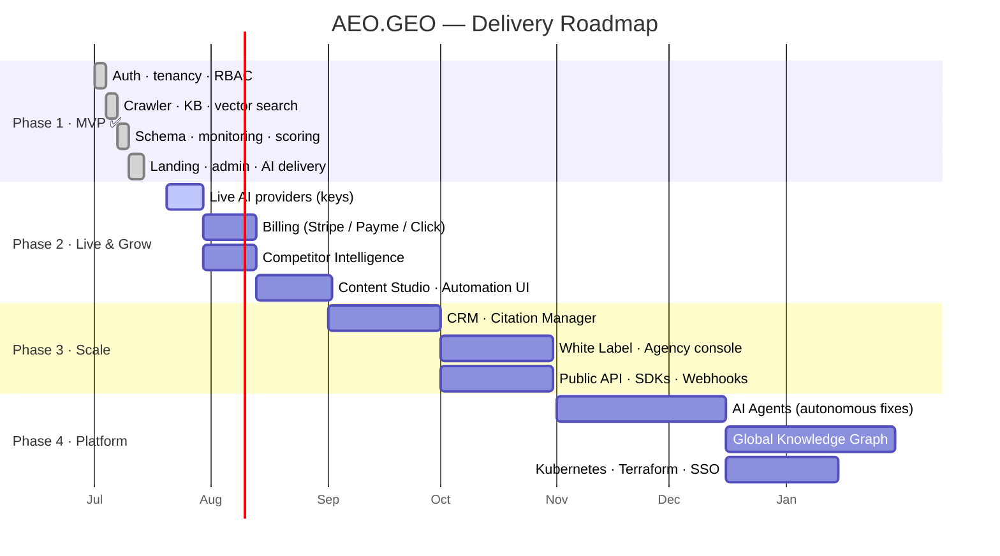

```mermaid
flowchart LR
    T([POST /crawl/]) --> C[Create CrawlResult<br/>status: pending]
    C --> Q{{Celery queue}}
    Q --> F[Fetch main page]
    F --> P[Parse title · meta · canonical]
    P --> R[Check robots.txt & sitemap.xml]
    R --> L[Classify internal/external links]
    L --> B[Probe links → broken?]
    B --> S[Compute performance score]
    S --> D[(Save meta · status: done)]
    style D fill:#0B2E1F,stroke:#3FB950,color:#E5E7EB
```

<div align="center">


# AEO.GEO

### The AI Visibility Operating System

**Make your brand understandable, trustworthy and discoverable by every AI answer engine —<br/>ChatGPT · Gemini · Claude · Perplexity · Copilot · and whatever comes next.**

<br/>

<!-- Typing banner -->
<a href="#-vision">
  
</a>

<br/><br/>

<!-- Primary badges -->
<p>
  
  
  
  
</p>

<!-- Tech badges -->
<p>
  
  
  
  
  
  
  
  
  
  
  
  
</p>

<br/>

<!-- Nav buttons -->
<p>
  <a href="#-quick-start"></a>
  <a href="#-product-tour"></a>
  <a href="#-architecture"></a>
  <a href="#-roadmap"></a>
  <a href="#-license"></a>
</p>

<br/>

<samp>Crawl your world · build a knowledge graph · generate schema.org & llms.txt · run answer-engine scans · score six ways · deliver to the crawlers · watch it climb.</samp>

</div>

<br/>

---

<div align="center">

`Google told you where you rank.` **`AEO.GEO tells you what the AI says about you — and fixes it.`**

</div>

---

<br/>

## 📖 Table of Contents

<table>
<tr>
<td valign="top">

**Product**
- [🌌 Vision](#-vision)
- [🔥 The Problem](#-the-problem)
- [💡 The Solution](#-the-solution)
- [🖥 Product Tour](#-product-tour)
- [✨ Core Features](#-core-features)

</td>
<td valign="top">

**Engineering**
- [🏛 Architecture](#-architecture)
- [🧠 The AI Pipeline](#-the-ai-pipeline)
- [🧬 Knowledge Graph & RAG](#-knowledge-graph--rag)
- [🛠 Tech Stack](#-tech-stack)
- [🗂 Folder Structure](#-folder-structure)
- [🔌 API](#-api-reference)

</td>
<td valign="top">

**Operate & Grow**
- [⚡ Quick Start](#-quick-start)
- [🚢 Deployment](#-deployment)
- [🛡 Security](#-security)
- [📈 Performance](#-performance--scale)
- [🗺 Roadmap](#-roadmap)
- [💰 Business Model](#-business-model)
- [🥊 Competitive Edge](#-competitive-edge)
- [🤝 Contributing](#-contributing)

</td>
</tr>
</table>

<br/>

## 🌌 Vision

> [!IMPORTANT]
> **The interface to human knowledge is changing from a _list of links_ to a _single answer_.**
> The winners of the last era optimized for the ten blue links. The winners of the next era will optimize for the one paragraph an AI speaks aloud.

For twenty-five years, "being found" meant ranking on Google. A page, a position, a click. That contract is dissolving. People now open ChatGPT, Perplexity, Gemini or Claude and ask a question in plain language — and they get **one synthesized answer**, often with **no click at all**.

That answer is assembled from whatever the model can find, parse, trust and cite. If your business is not **machine-readable**, you are not in the answer. You are invisible — not on page two, but nowhere.

<div align="center">



</div>

**AEO** (Answer Engine Optimization) and **GEO** (Generative Engine Optimization) are the discipline of making a business findable, accurately described and recommendable **by AI systems**. AEO.GEO is the operating system for that discipline: it ingests your world, structures it into machine-readable knowledge, ships that knowledge to where crawlers actually read, then continuously measures how the models talk about you — and tells you exactly what to fix.

<br/>

## 🔥 The Problem

<table>
<tr>
<td width="33%" valign="top" align="center">

### 🕳️
**You disappear in AI answers**

Your website was written for humans and Google. Answer engines see scattered, unstructured text, so they guess — or skip you entirely and recommend a competitor who is easier to parse.

</td>
<td width="33%" valign="top" align="center">

### 👻
**Hallucinations misrepresent you**

When the facts about you aren't structured and verifiable, models invent them: wrong pricing, outdated services, a fabricated founding story. You don't control the narrative — the model does.

</td>
<td width="33%" valign="top" align="center">

### 📉
**SEO is no longer enough**

SEO optimizes a page for a ranking algorithm. AI answers need **structured knowledge** — schema.org, machine-readable FAQs, consistent facts, `llms.txt`. Good SEO helps. It does not finish the job.

</td>
</tr>
</table>

> [!WARNING]
> **The blind spot is total.** Traditional analytics cannot see a zero-click AI answer. You can lose an entire channel of demand — the fastest-growing one — without a single line moving on your dashboard. What you cannot measure, you cannot defend.

<div align="center">



</div>

<br/>

## 💡 The Solution

**AEO.GEO turns your unstructured business into knowledge that AI can read, trust and cite — then proves it worked.**

Two halves make it whole. Most tools stop at the first.

<table>
<tr>
<th width="50%">🔬 The Measurement Half</th>
<th width="50%">🚀 The Delivery Half</th>
</tr>
<tr>
<td valign="top">

Import your site & documents → build a per-tenant **knowledge graph** in a vector database → run your **Prompt Library** against real AI providers → parse every answer for **mention, sentiment and citations** → roll it into **six transparent 0–100 scores**.

You finally *see* what the machines say.

</td>
<td valign="top">

Generate **grounded** schema.org JSON-LD (never invented), an **`llms.txt`** from your real content, a public **AI-crawlable profile page**, and copy-paste **robots.txt rules** for GPTBot / ClaudeBot / PerplexityBot.

You finally *change* what the machines say.

</td>
</tr>
</table>

> [!TIP]
> **The whole platform runs with zero AI API keys.** A provider-agnostic gateway falls back to a deterministic, realistic **mock mode** — so the entire chain (crawl → embed → scan → score → deliver) is buildable, demoable and testable offline. Drop a real key into `.env` and that provider goes live. No code change. See [`docs/adr/001-mock-mode.md`](docs/adr/001-mock-mode.md).

<br/>

## 🖥 Product Tour

<div align="center">

### The Dashboard — six scores, one glance

</div>

```
┌──────────────────────────────────────────────────────────────────────────────┐
│  AEO.GEO   ▸ Acme Robotics                              ◐ theme   ⚙ settings   │
├──────────────────────────────────────────────────────────────────────────────┤
│  SIGNAL SPECTRUM · ACME ROBOTICS                                               │
│                                                                                │
│   81 ▁▃▅▇  Overall AI Visibility · Strong          [ ▶ Run scan ]  [ ✦ Prompts ]│
│                                                                                │
│  ┌────────────┐ ┌────────────┐ ┌────────────┐ ┌────────────┐ ┌────────────┐   │
│  │ AI VISIB.  │ │ GEO        │ │ AEO        │ │ TRUST      │ │ CITATION   │   │
│  │    ◕ 81    │ │    ◑ 74    │ │    ● 88    │ │    ◕ 77    │ │    ◔ 62    │   │
│  │  Strong    │ │  Fair      │ │  Strong    │ │  Strong    │ │  Fair      │   │
│  └────────────┘ └────────────┘ └────────────┘ └────────────┘ └────────────┘   │
│                                                                                │
│  AI VISIBILITY · LAST 12 SCANS                                       ▲ trend   │
│     22 ─ 30 ─ 27 ─ 38 ─ 45 ─ 41 ─ 54 ─ 60 ─ 58 ─ 70 ─ 76 ─ 81  ╱╱╱╱╱▔         │
└──────────────────────────────────────────────────────────────────────────────┘
```

<details>
<summary><b>🧬 Knowledge Base</b> — import, chunk, embed, search</summary>

<br/>

Upload pasted text, a website URL, or a **PDF / DOCX / TXT** file. AEO.GEO extracts the text, chunks it on sentence boundaries, embeds each chunk into a **1536-dimension** vector, and stores it in a **per-organization Qdrant collection** (`org_{id}`). A semantic search box lets you query your own knowledge instantly.

```
Document  ▸ "About Acme"  ▸ status: done  ▸ 14 chunks  ▸ lang: en
Search    ▸ "industrial robotics automation"
          → 0.55  About Acme      "Acme builds industrial robots and offers…"
          → 0.00  Bakery deck     "Sunrise Bakery bakes fresh sourdough…"
```

</details>

<details>
<summary><b>🔭 AI Monitoring</b> — Prompt Library × providers = scan results</summary>

<br/>

Auto-generate a **Prompt Library** across five intents (brand · product · comparison · local · faq), then scan every prompt against every provider. Each answer is parsed into structured signals.

```
27 scan results  (9 prompts × 3 providers)
mentioned  21/27   ·   sentiment  {positive 16, neutral 8, negative 3}   ·   cited  13/27
```

</details>

<details>
<summary><b>📡 AI Optimization & Delivery</b> — schema.org, llms.txt, public profile</summary>

<br/>

Grounded generation only — **every fact comes from your Knowledge Base, nothing is invented.** Publish an opt-in, server-rendered, AI-crawlable profile at `/p/<slug>/` carrying embedded JSON-LD + FAQ, plus a generated `/p/<slug>/llms.txt`.

```
✔ Organization schema   valid
✔ FAQPage schema        valid   (6 grounded Q&A)
✔ llms.txt              generated from real content
▸ Public profile        /p/acme-robotics/     ● live
```

</details>

<details>
<summary><b>🛰 Platform Admin</b> — monitor everything, fix it from the panel</summary>

<br/>

A superuser control tower: live **system health** (Postgres · Redis · Qdrant · Celery), platform-wide stats, **waitlist signups**, users, organizations, a full **audit feed**, and an **Issues** tab that lists every failed job with a one-click **Retry** — plus block/unblock users, change plans, dispatch scans, recompute all scores. Every admin action is audit-logged.

</details>

<br/>

## ✨ Core Features

<div align="center"><i>50+ capabilities, grouped. ✅ shipped in MVP · 🟡 partial · 🔮 on the roadmap</i></div>

<br/>

<details open>
<summary><b>🔐 Identity, Tenancy & Access</b></summary>

| Feature | Status | Notes |
|---|:---:|---|
| Email-based auth (custom user) | ✅ | Username removed, email is the identifier |
| JWT access + refresh | ✅ | `djangorestframework-simplejwt` |
| Redis-backed refresh revocation | ✅ | Real logout / token kill switch |
| Multi-tenant organizations | ✅ | Shared-schema, row-level isolation |
| Membership & 10-role RBAC | ✅ | Role lives on membership, not the user |
| Invite flow + accept-invite | ✅ | Signed 48h token, no extra library |
| Password reset (email link) | ✅ | One-time, 1-hour, no account enumeration |
| Rate limiting / anti-brute-force | ✅ | Per-IP throttles on all credential routes |
| 2FA / TOTP | 🔮 | Roadmap |
| SSO / SAML / OIDC | 🔮 | Enterprise roadmap |

</details>

<details open>
<summary><b>🌐 Website Manager & Crawler</b></summary>

| Feature | Status | Notes |
|---|:---:|---|
| On-demand site crawl (Celery) | ✅ | Fetcher abstraction, testable offline |
| Title / meta / canonical extraction | ✅ | Core AEO signals |
| robots.txt & sitemap.xml detection | ✅ | Presence checks |
| Internal / external link classification | ✅ | Per crawl |
| Broken-link detection | ✅ | Bounded, with HTTP status |
| Performance score | ✅ | From main-page load time |
| Scheduled re-crawls | 🔮 | Automation module |

</details>

<details open>
<summary><b>🧬 Knowledge Base & Vector Search</b></summary>

| Feature | Status | Notes |
|---|:---:|---|
| Text / Website / PDF / DOCX / TXT import | ✅ | `pdfplumber`, `python-docx`, `trafilatura` |
| Sentence-aware chunking | ✅ | No tokenizer download — offline safe |
| 1536-dim embeddings | ✅ | OpenAI `text-embedding-3-small` compatible |
| Deterministic mock embeddings | ✅ | Feature-hash, real lexical similarity |
| Per-tenant Qdrant collections | ✅ | `org_{id}` isolation |
| Semantic search endpoint | ✅ | Cosine, top-k |
| Async status polling | ✅ | `pending → processing → done/failed` |
| Content-hash de-dup on re-sync | 🔮 | Skip unchanged docs |

</details>

<details open>
<summary><b>📡 AI Optimization & Delivery</b></summary>

| Feature | Status | Notes |
|---|:---:|---|
| FAQ schema (grounded) | ✅ | Answers pulled from KB, zero fabrication |
| Organization schema | ✅ | From org + domain + KB |
| Product / Breadcrumb builders | ✅ | Validator included |
| JSON-LD validation | ✅ | Blocks invalid markup |
| `llms.txt` generation | ✅ | llmstxt.org convention |
| Public AI-crawlable profile `/p/<slug>/` | ✅ | Opt-in, server-rendered, embedded JSON-LD |
| Copy-paste JSON-LD & robots.txt snippets | ✅ | GPTBot / ClaudeBot / PerplexityBot |
| LLM-refined FAQ wording | 🔮 | Grounding stays; polish via gateway |

</details>

<details open>
<summary><b>🔭 AI Monitoring & Scoring</b></summary>

| Feature | Status | Notes |
|---|:---:|---|
| Provider-agnostic gateway | ✅ | OpenAI · Anthropic · Gemini, one interface |
| Deterministic realistic mock mode | ✅ | Hash-based distribution (ADR condition #1) |
| Prompt Library (5 categories) | ✅ | Manual + auto-generate |
| Multi-provider scan (Celery) | ✅ | Prompts × providers |
| Mention / sentiment / citation parsing | ✅ | Per scan result |
| Six transparent scores | ✅ | Visibility · GEO · AEO · SEO · Trust · Citation |
| ScoreSnapshot history + trend | ✅ | Dashboard trend line |
| Nightly score refresh (Celery Beat) | ✅ | Fans out per org |
| Live provider auto-switch on key add | ✅ | No code change |

</details>

<details open>
<summary><b>🛰 Admin, Billing & Ops</b></summary>

| Feature | Status | Notes |
|---|:---:|---|
| Superuser platform panel | ✅ | Stats, users, orgs, leads, audit |
| Live system health checks | ✅ | Postgres · Redis · Qdrant · Celery |
| Issues tab + one-click Retry | ✅ | Fix failed jobs from the UI |
| Admin actions (block, plan, scan, recompute) | ✅ | All audit-logged |
| Marketing waitlist capture | ✅ | Landing → `Lead` model |
| CSV export (leads) | ✅ | From admin panel |
| Append-only audit log | ✅ | Security actions, read-only in admin |
| Subscription model (Stripe/Payme/Click) | 🟡 | Structure shipped, payment flow roadmap |
| Usage-based billing | 🔮 | Pay-per-visibility |

</details>

<details open>
<summary><b>🎨 Frontend, Landing & i18n</b></summary>

| Feature | Status | Notes |
|---|:---:|---|
| "Signal Spectrum" design system | ✅ | Dark-first, radial gauges, spectrum hero |
| Dashboard SPA (React + Vite + TS) | ✅ | Typed API layer, JWT interceptor |
| Marketing landing (Next.js, SSG) | ✅ | 3D knowledge-graph hero (R3F) |
| Trilingual: English · Русский · Oʻzbek | ✅ | `/en` `/ru` `/uz`, hreflang, per-locale JSON-LD |
| Dog-fooded AEO (readable JS-off) | ✅ | Lighthouse 95 / A11y 100 / SEO 100 |
| `prefers-reduced-motion` + mobile fallback | ✅ | 3D → static SVG |

</details>

<br/>

## 🏛 Architecture

<div align="center">

### System Architecture



</div>

<details>
<summary><b>🔑 Authentication & Tenant Isolation (sequence)</b></summary>

<br/>



</details>

<details>
<summary><b>🕸 Crawler Pipeline (flow)</b></summary>

<br/>



</details>

<details>
<summary><b>🔔 Notification & Audit (flow)</b></summary>

<br/>



</details>

<br/>

## 🧠 The AI Pipeline

<div align="center">



</div>

> [!NOTE]
> **The loop closes.** Analytics feeds recommendations back into Optimization. Low citation score → "publish your profile, ship your llms.txt." The system doesn't just measure; it tells you the next move.

<br/>

## 🧬 Knowledge Graph & RAG

<div align="center">



</div>

The **Knowledge Base** is a real retrieval-augmented system: every organization owns an isolated Qdrant collection; the Postgres `Chunk` row keeps the DB↔vector link. Generation is **retrieval-grounded** — FAQ answers and `llms.txt` are drawn from the top-k matches of the org's own content, so the platform never fabricates facts. In mock mode the embedder is a deterministic feature-hash that still produces meaningful lexical similarity, so retrieval works offline and the vector schema stays identical when you switch to a real provider.

<br/>

## 🛠 Tech Stack

<table>
<tr>
<td valign="top" width="25%">

**Frontend**
- React 18 + TypeScript
- Vite (dashboard SPA)
- Next.js 16 (landing, SSG)
- Tailwind CSS v4
- Recharts
- Framer Motion
- React Three Fiber (3D)
- Lenis (smooth scroll)

</td>
<td valign="top" width="25%">

**Backend**
- Python 3.12
- Django 5.2 + DRF
- SimpleJWT
- Celery 5.6 + Beat
- drf-nested-routers
- WhiteNoise
- Gunicorn

</td>
<td valign="top" width="25%">

**AI & Data**
- Qdrant (vector DB)
- OpenAI / Anthropic / Gemini
- `text-embedding-3-small` (1536)
- pdfplumber · python-docx
- trafilatura · BeautifulSoup
- tenacity (retries)

</td>
<td valign="top" width="25%">

**Infra & Ops**
- Docker + Compose
- PostgreSQL 16
- Redis 7
- Nginx reverse proxy
- GitHub Actions CI
- Let's Encrypt (TLS)
- Kubernetes _(roadmap)_

</td>
</tr>
</table>

<br/>

## 🗂 Folder Structure

```
AEO-GEO/
├── backend/                          # Django + DRF + Celery
│   ├── config/                       # settings · urls · celery (+ beat schedule)
│   ├── apps/
│   │   ├── common/                   # mock/live mode · health · audit · platform panel API
│   │   ├── accounts/                 # email User · JWT · RBAC roles · invites · reset
│   │   ├── organizations/            # Organization · Membership · Domain · permissions
│   │   ├── website_manager/          # crawler (Fetcher abstraction) · CrawlResult
│   │   ├── knowledge_base/           # extract · chunk · embed(1536) · Qdrant · search
│   │   ├── ai_optimization/          # schema.org · llms.txt · public profile · delivery
│   │   ├── ai_monitoring/            # provider gateway · Prompt · ScanResult
│   │   ├── dashboard/                # ScoreSnapshot · 6-score formulas
│   │   └── billing/                  # Subscription (structure)
│   ├── requirements.txt
│   ├── Dockerfile · Dockerfile.prod
│   └── manage.py
├── frontend/                         # Dashboard SPA (React + Vite + TS + Tailwind)
│   └── src/
│       ├── pages/                    # Login · Onboarding · Dashboard · Documents · Website
│       │                             #   Schema · Settings · AdminPanel · Accept-Invite · Reset
│       ├── components/               # ui/ · layout/ · dashboard/ · schema/
│       ├── context/ · hooks/ · lib/  # auth · org · toast · theme · typed API client
│       └── types/api.ts              # the full API contract, typed
├── landing/                          # Marketing site (Next.js 16 · App Router · SSG)
│   ├── app/[lang]/                   # /en /ru /uz · metadata · JSON-LD · og-image
│   ├── components/                   # hero (3D graph) · sections · site
│   └── lib/dictionaries/             # en · ru · uz copy (single source → also feeds JSON-LD)
├── deploy/
│   ├── nginx/                        # front-proxy template (domain envsubst)
│   └── DEPLOY.md                     # first deploy · TLS · backups · ops
├── docs/
│   ├── adr/001-mock-mode.md          # the architecture decision that makes it all offline-capable
│   └── api-contract.md               # endpoint-by-endpoint contract
├── docker-compose.yml                # local: 7 services, one command
├── docker-compose.prod.yml           # production: gunicorn · nginx · prod images
└── .github/workflows/ci.yml          # backend tests + both frontend builds
```

<br/>

## 🔌 API Reference

<div align="center"><i>All organization-scoped routes are nested under <code>/api/organizations/{id}/…</code>, require a Bearer token, and are membership-checked from the URL — never trusted from the body.</i></div>

<br/>

<details open>
<summary><b>Auth</b></summary>

| Method | Endpoint | Body | Returns |
|---|---|---|---|
| `POST` | `/api/auth/register/` | `{ email, password, full_name? }` | `201` user |
| `POST` | `/api/auth/login/` | `{ email, password }` | `{ access, refresh, user }` |
| `POST` | `/api/auth/refresh/` | `{ refresh }` | `{ access }` (401 if revoked) |
| `POST` | `/api/auth/logout/` | `{ refresh }` | `205` (revokes in Redis) |
| `POST` | `/api/auth/forgot-password/` | `{ email }` | `200` (always — no enumeration) |
| `POST` | `/api/auth/reset-password/` | `{ uid, token, password }` | `200` |
| `POST` | `/api/auth/accept-invite/` | `{ token, password }` | `200` |
| `GET`  | `/api/auth/me/` | — | current user |

</details>

<details>
<summary><b>Organizations · Knowledge · Monitoring · Delivery</b></summary>

| Method | Endpoint | Purpose |
|---|---|---|
| `GET/POST` | `/api/organizations/` | list (own) · create (creator → owner) |
| `GET/POST` | `/api/organizations/{id}/domains/` | manage domains |
| `POST` | `/api/organizations/{id}/invite/` | invite member (returns invite link) |
| `POST` | `/api/organizations/{id}/crawl/` | `202` async crawl |
| `POST` | `/api/organizations/{id}/documents/` | upload (text/website/pdf/docx/txt) |
| `GET` | `/api/organizations/{id}/documents/{doc}/status/` | poll ingestion |
| `POST` | `/api/organizations/{id}/documents/search/` | semantic search |
| `POST` | `/api/organizations/{id}/schema-markup/generate/` | grounded JSON-LD |
| `GET` | `/api/organizations/{id}/schema-markup/llms-txt/` | preview llms.txt |
| `POST` | `/api/organizations/{id}/prompts/generate/` | starter Prompt Library |
| `POST` | `/api/organizations/{id}/scan/` | `202` scan all prompts × providers |
| `GET` | `/api/organizations/{id}/dashboard/` | `{ latest, trend, summary }` |
| `GET` | `/p/{slug}/` · `/p/{slug}/llms.txt` | public, opt-in, AI-crawlable |

</details>

<details>
<summary><b>Platform Admin (superuser only)</b></summary>

| Method | Endpoint | Purpose |
|---|---|---|
| `GET` | `/api/platform/overview/` | totals · 7-day deltas · 14-day timeseries · provider modes |
| `GET` | `/api/platform/health/` | live Postgres · Redis · Qdrant · Celery checks |
| `GET` | `/api/platform/issues/` | failed documents / crawls / schemas |
| `GET` | `/api/platform/{leads,users,organizations,audit}/` | paginated lists |
| `POST` | `/api/platform/actions/` | retry · toggle-user · set-plan · run-scan · refresh-scores |

</details>

> [!NOTE]
> **Rate limits.** Credential endpoints are throttled per-IP (default `10/min`); the public waitlist is `30/hour`. List endpoints are paginated (`50`/page: `{ count, next, previous, results }`). **GraphQL** and public **API keys** are on the roadmap.

<br/>

## ⚡ Quick Start

> [!TIP]
> **One command. No AI keys required.** The whole product boots in mock mode.

```bash
# 1 · clone
git clone https://github.com/Begzod2004/AEO-GEO.git && cd AEO-GEO

# 2 · (optional) configure — runs in mock mode with no keys
cp .env.example .env

# 3 · launch the whole stack
docker compose up --build
```

```bash
# 4 · seed a superuser + a fully-populated demo org
docker compose exec backend python manage.py seed_demo
```

<div align="center">

| Surface | URL | Credentials |
|---|---|---|
| 🖥 **Dashboard** | `http://localhost:5173` | `demo@aeo.geo` · `Signals2026!` |
| 🌐 **Landing** | `http://localhost:3000` | — |
| 🛰 **Admin** | `http://localhost:8000/admin/` | `admin@aeo.geo` · `AeoAdmin2026!` |
| ❤️ **Health** | `http://localhost:8000/api/health/` | — |

</div>

```bash
# Run the test suite (89 tests, fully offline: sqlite · in-memory Qdrant · eager Celery)
cd backend && python manage.py test apps
```

> [!IMPORTANT]
> **Going live with real AI** is a one-line change: add `ANTHROPIC_API_KEY=` or `OPENAI_API_KEY=` to `.env` and restart. The provider-agnostic gateway switches that provider from mock to live automatically — no code changes, because that is exactly what the architecture was built for.

<br/>

## 🚢 Deployment



<table>
<tr>
<td valign="top" width="50%">

**Local dev** — `docker-compose.yml`
7 services, one command, hot reload, mock mode.

**Production** — `docker-compose.prod.yml`
Gunicorn backend (`DEBUG=false`, boots refuse the dev key), static SPA via Nginx, Next.js landing, front proxy routing two domains same-origin (no CORS), required-env guards.

</td>
<td valign="top" width="50%">

**Runbook** — [`deploy/DEPLOY.md`](deploy/DEPLOY.md)
First deploy · TLS via certbot · zero-downtime updates · Postgres backups · ops crib sheet.

**Roadmap** — Kubernetes manifests, Terraform IaC, Helm chart, blue-green.

</td>
</tr>
</table>

<br/>

## 🛡 Security

| Control | Status | Implementation |
|---|:---:|---|
| Password hashing | ✅ | Django PBKDF2 |
| JWT with server-side revocation | ✅ | Redis jti registry |
| Multi-tenant row isolation | ✅ | Queryset-scoped, URL-resolved membership |
| Role-based access control | ✅ | `IsOrgMember` · `HasRole(*roles)` |
| Anti-brute-force throttling | ✅ | Per-IP on credential routes |
| Account-enumeration safe reset | ✅ | Always `200`, one-time tokens |
| Append-only audit log | ✅ | Failures never break the business op |
| Secrets via environment only | ✅ | Nothing hardcoded, ever |
| Production hardening | ✅ | Secure cookies · proxy SSL header · dev-key boot guard |
| No-key offline safety | ✅ | Mock mode = no accidental live calls in test |
| 2FA · SSO · IP allowlists · API keys | 🔮 | Roadmap |

> [!WARNING]
> This is an MVP codebase. Before production: set a strong `DJANGO_SECRET_KEY`, wire real SMTP, terminate TLS, rotate the seeded demo passwords, and complete the roadmap security items.

<br/>

## 📈 Performance & Scale

<table>
<tr>
<td valign="top" width="50%">

**Async by design**
Every heavy operation — crawl, extraction, embedding, scan, scoring — runs in **Celery**, never in the request cycle. The API returns `202` and the client polls.

**Caching & queue**
Redis is cache, message broker and token registry. Celery Beat drives periodic score refreshes.

</td>
<td valign="top" width="50%">

**Frontend vitals (measured)**
Landing: **Lighthouse Performance 95 · Accessibility 100 · Best-Practices 100 · SEO 100**, LCP 2.8s, CLS 0.004. The 3D scene is lazy-loaded off the critical path.

**Bounded everywhere**
Pagination on all lists, broken-link probes capped, per-tenant vector collections keep search fast.

</td>
</tr>
</table>

<br/>

## 🗺 Roadmap



<br/>

## 💰 Business Model

<table>
<tr>
<th>Plan</th><th>Price*</th><th>For</th><th>Highlights</th>
</tr>
<tr>
<td><b>Starter</b></td><td><code>$29/mo</code></td><td>Solo & small business</td><td>1 org · monthly scans · KB to 100 pages · FAQ + Org schema</td>
</tr>
<tr>
<td><b>Pro</b> ⭐</td><td><code>$79/mo</code></td><td>Growing teams</td><td>3 domains · weekly scans (all engines) · full schema · trend analytics · priority support</td>
</tr>
<tr>
<td><b>Business</b></td><td><code>$199/mo</code></td><td>Serious brands</td><td>10 domains · daily scans + alerts · API access · competitor snapshots</td>
</tr>
<tr>
<td><b>Enterprise</b></td><td><code>Custom</code></td><td>Large orgs & agencies</td><td>Unlimited · custom cadence & SLAs · White Label · dedicated success</td>
</tr>
</table>

<sub>*Early-access pricing, illustrative and subject to change before public launch.</sub>

**Beyond subscriptions:** Agency tier · **White Label** · paid **API** access · AI consulting · Managed GEO service · future usage-based *pay-per-visibility*. The revenue compounds with the customer's success — the more visible they get, the more they invest.

<br/>

## 🥊 Competitive Edge

<div align="center">

| Capability | **AEO.GEO** | Semrush | Profound | AthenaHQ | Peec AI | Otterly |
|---|:---:|:---:|:---:|:---:|:---:|:---:|
| Answer-engine **monitoring** | ✅ | 🟡 | ✅ | ✅ | ✅ | ✅ |
| Transparent, **inspectable** scores | ✅ | ❌ | 🟡 | 🟡 | 🟡 | 🟡 |
| **Grounded** schema.org generation | ✅ | ❌ | ❌ | ❌ | ❌ | ❌ |
| **`llms.txt`** generation | ✅ | ❌ | ❌ | ❌ | ❌ | ❌ |
| Public **AI-crawlable profile** | ✅ | ❌ | ❌ | ❌ | ❌ | ❌ |
| Owns the **vector knowledge base** | ✅ | ❌ | 🟡 | 🟡 | ❌ | ❌ |
| **Measure _and_ deliver** (both halves) | ✅ | ❌ | ❌ | ❌ | ❌ | ❌ |
| **Multi-tenant** SaaS + agency-ready | ✅ | ✅ | 🟡 | 🟡 | 🟡 | 🟡 |
| **Self-hostable**, open architecture | ✅ | ❌ | ❌ | ❌ | ❌ | ❌ |
| Runs **fully offline** (mock mode) | ✅ | ❌ | ❌ | ❌ | ❌ | ❌ |
| Trilingual incl. **CIS / Oʻzbek** market | ✅ | 🟡 | ❌ | ❌ | ❌ | ❌ |

</div>

> [!IMPORTANT]
> **Everyone else measures. AEO.GEO measures _and_ fixes.** The delivery half — grounded schema, `llms.txt`, the public profile, crawler-allow snippets — is what actually moves the score. Monitoring without delivery is a thermometer. AEO.GEO is the thermostat.

<br/>

## 🖼 Screenshots

> [!NOTE]
> Live surfaces (run `docker compose up`, then `seed_demo`). Static previews below.

<div align="center">

| Landing (3D hero) | Dashboard (Signal Spectrum) |
|:---:|:---:|
|  |  |

| Platform Admin | AI Delivery (Schema) |
|:---:|:---:|
|  |  |

</div>

<br/>

## 🤝 Contributing

We build in the open architecture, review with rigor, and ship with tests.

```bash
# 1 · branch
git checkout -b feat/your-feature

# 2 · backend: keep it green (89 tests, offline)
cd backend && python manage.py test apps

# 3 · frontend: typecheck must pass
cd frontend && npm run build
cd landing  && npm run build

# 4 · open a PR — CI runs tests + both builds automatically
```

<details>
<summary><b>Contribution principles</b></summary>

<br/>

- **DRY · KISS · YAGNI.** Minimal, correct, no speculative abstraction.
- **Tenant isolation is sacred.** Never `Model.objects.all()` on tenant data — always scope by `organization_id` resolved from the URL.
- **Grounded generation only.** Never fabricate facts about a customer. Zero hallucination is a product promise, not a preference.
- **Mock mode must keep working.** Every external dependency goes through the mode switch; tests stay offline and deterministic.
- **Verify by running it.** Claims of "done" come with real command output, not assertions.

</details>

<br/>

## ❓ FAQ

<details>
<summary><b>What is AEO / GEO, in one sentence?</b></summary>
<br/>
Making your business findable, accurately described and recommendable by AI assistants — the way SEO does for Google search.
</details>

<details>
<summary><b>How is this different from SEO tools?</b></summary>
<br/>
SEO optimizes pages for ranking algorithms. AEO.GEO optimizes your <i>knowledge</i> for AI-generated answers, and — crucially — it also <b>delivers</b> that knowledge (schema, llms.txt, a crawlable profile) to where the models read.
</details>

<details>
<summary><b>Do I need API keys to try it?</b></summary>
<br/>
No. The entire platform runs in deterministic mock mode with zero keys. Add a key later and it goes live automatically.
</details>

<details>
<summary><b>How do you avoid hallucinated schema?</b></summary>
<br/>
Generation is retrieval-grounded. Every FAQ answer and llms.txt line is pulled from the organization's own Knowledge Base via vector search. If the content isn't there, the platform refuses to invent it and reports the gap.
</details>

<details>
<summary><b>Is it multi-tenant / agency ready?</b></summary>
<br/>
Yes — shared-schema multi-tenancy with strict row-level isolation, per-org vector collections, and a 10-role RBAC system. White Label and an agency console are on the roadmap.
</details>

<br/>

## 📜 License

Released under the **MIT License**. See [`LICENSE`](LICENSE).

<br/>

## 📬 Contact

<div align="center">


</div>

<br/>
<br/>

<div align="center">

##  AEO.GEO

**Search became conversation. Make sure the machines know your name.**

<sub>Crawl → Structure → Optimize → Monitor → Deliver → Repeat.</sub>

<br/>


<br/><br/>

<sub>© 2026 AEO.GEO — The AI Visibility Operating System. Every business deserves to be understood by AI.</sub>

</div>
